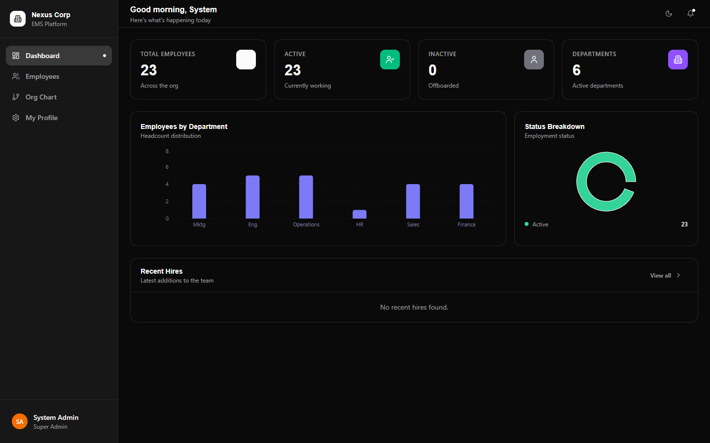
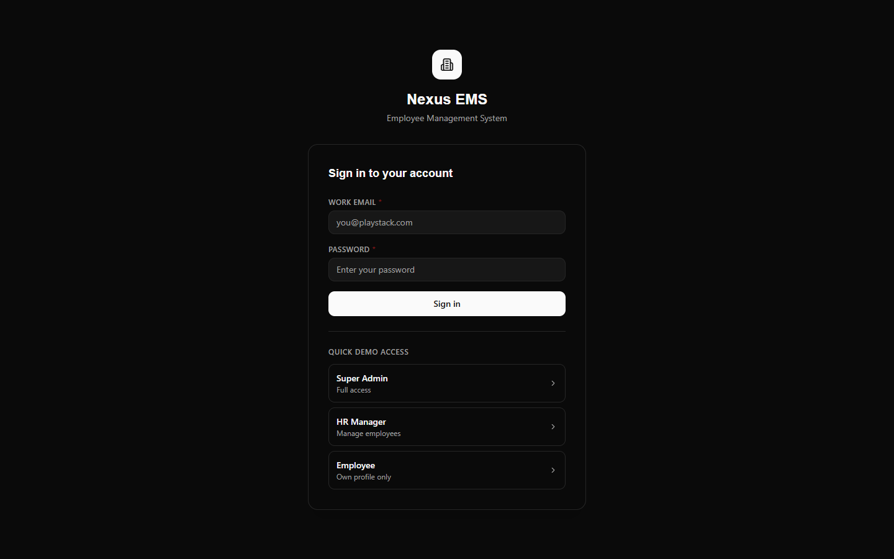
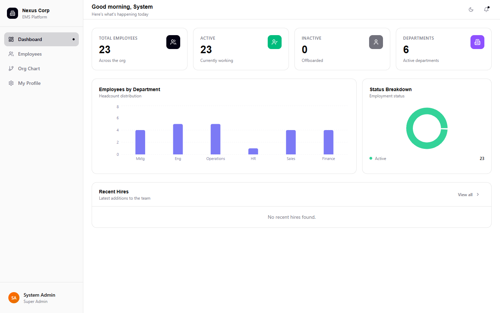
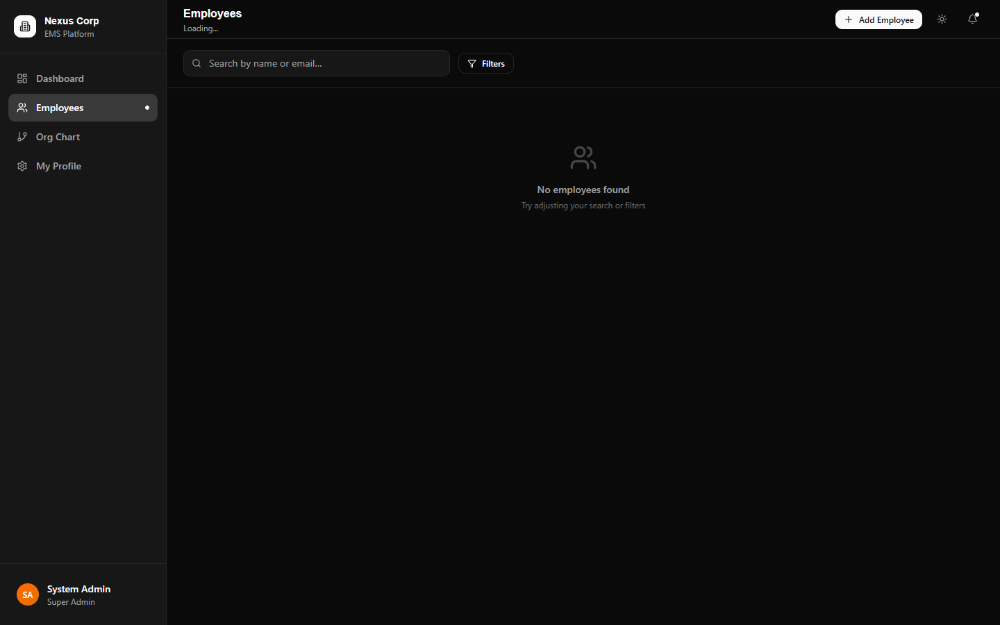
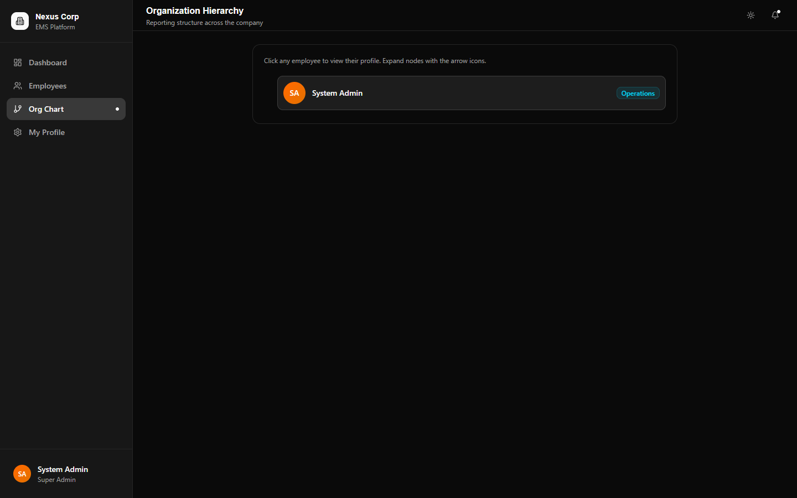

# Nexus Employee Management System (EMS)



## 📌 Project Overview
Nexus EMS is a modern, enterprise-grade Employee Management System designed to streamline HR operations. It provides a highly responsive, aesthetic, and fully-featured dashboard to manage employee directories, track department hierarchies, and maintain personnel records with strict Role-Based Access Control (RBAC). The platform features an impeccable pixel-perfect UI generated from a custom Figma design, ensuring an engaging user experience (UX) and seamless transitions.

## ✨ Features
- **Secure Authentication & RBAC**: Role-Based Access Control (Super Admin, HR Manager, Employee) with JWT-based session persistence and secure HTTP standards.
- **Interactive Dashboard**: Real-time analytics, status metrics, and department breakdowns visualized through interactive widgets and Recharts.
- **Comprehensive Employee CRUD**: Advanced sorting, filtering, server-side pagination, and search capabilities across the entire organizational directory.
- **Organizational Hierarchy**: Visual mapping of direct reports and manager-employee relationships.
- **Pixel-Perfect UI/UX**: Developed faithfully to Figma specifications utilizing Tailwind V4, Lucide React icons, smooth micro-animations, and responsive glassmorphic layouts.
- **Dynamic Theming**: First-class support for Light and Dark modes.

## 🛠️ Tech Stack
- **Frontend**: React 19, TypeScript, Vite, Tailwind CSS V4, React Query (TanStack), Axios, Recharts, React Router DOM, React Hot Toast.
- **Backend**: Node.js, Express, TypeScript, MongoDB (Mongoose), JSON Web Tokens (JWT), Bcrypt.

## 📐 Architecture
The application follows a clean, layered architecture separating the **Presentation Layer** (React/Vite), **Service Layer** (React Query/Axios), **API Layer** (Express Controllers/Routes), and **Data Layer** (MongoDB/Mongoose Models). For detailed architectural diagrams and flow, please see the [Architecture Documentation](ARCHITECTURE.md).

## 📂 Folder Structure
```
├── backend/
│   ├── src/
│   │   ├── config/       # Environment & Database config
│   │   ├── controllers/  # Route handlers
│   │   ├── middlewares/  # Auth & Validation guards
│   │   ├── models/       # Mongoose schemas
│   │   ├── routes/       # API endpoints
│   │   ├── services/     # Business logic
│   │   └── seed.ts       # Database seeding script
├── frontend/
│   ├── src/
│   │   ├── components/   # Reusable UI & FigmaShared
│   │   ├── hooks/        # React Query custom hooks
│   │   ├── pages/        # Route-level components
│   │   ├── providers/    # Context providers (Auth, Theme)
│   │   ├── services/     # Axios API client
│   │   └── index.css     # Global styles & Tailwind tokens
└── docs/                 # Screenshots and documentation
```

## 🚀 Installation & Running Locally

### Prerequisites
- Node.js (v18+)
- MongoDB Community Server (or Atlas URI)

### 1. Clone the repository
```bash
git clone https://github.com/your-username/nexus-ems.git
cd nexus-ems
```

### 2. Backend Setup
```bash
cd backend
npm install

# Create a .env file (see Environment Variables section)

# Seed the database with demo accounts
npm run seed

# Start the backend server
npm run dev
```

### 3. Frontend Setup
```bash
cd ../frontend
npm install

# Start the frontend dev server
npm run dev
```

## ⚙️ Environment Variables
Create a `.env` file in the `/backend` directory:
```env
PORT=5000
MONGO_URI=mongodb://localhost:27017/playstack
JWT_SECRET=your_super_secret_jwt_key
JWT_EXPIRES_IN=7d
```
No environment variables are strictly required for the frontend out-of-the-box, as Axios falls back to `http://localhost:5000/api`. For production, configure `VITE_API_URL`.

## 🔐 Role Credentials (Demo)
You can test the system using the following seeded credentials:

| Role | Email | Password | Access Level |
| :--- | :--- | :--- | :--- |
| **Super Admin** | `admin@playstack.com` | `Admin@123` | Full Access (CRUD all) |
| **HR Manager** | `hr@playstack.com` | `Hr@123` | Can view and edit all |
| **Employee** | `employee@playstack.com` | `Employee@123` | Read-only / Own profile |

## 📸 Screenshots

| Login | Dashboard (Light) | Dashboard (Dark) |
| :---: | :---: | :---: |
|  |  |  |

| Employee Directory | Employee Profile | Organization View |
| :---: | :---: | :---: |
|  |  |  |

## 🌐 API Endpoints
Comprehensive endpoint documentation including payloads and response structures is available in the [API Documentation](API_DOCUMENTATION.md).

## 🚢 Deployment
Detailed instructions for preparing the application for production (e.g. Vercel, Render, Railway) can be found in the [Deployment Guide](DEPLOYMENT_GUIDE.md).

## 🔮 Future Improvements
- Two-Factor Authentication (2FA) for HR Managers and Admins.
- Bulk CSV Employee Import/Export utility.
- Activity audit logs for Super Admins.
- Automated email notifications for account provisioning.

## 📄 License
This project is licensed under the MIT License.
